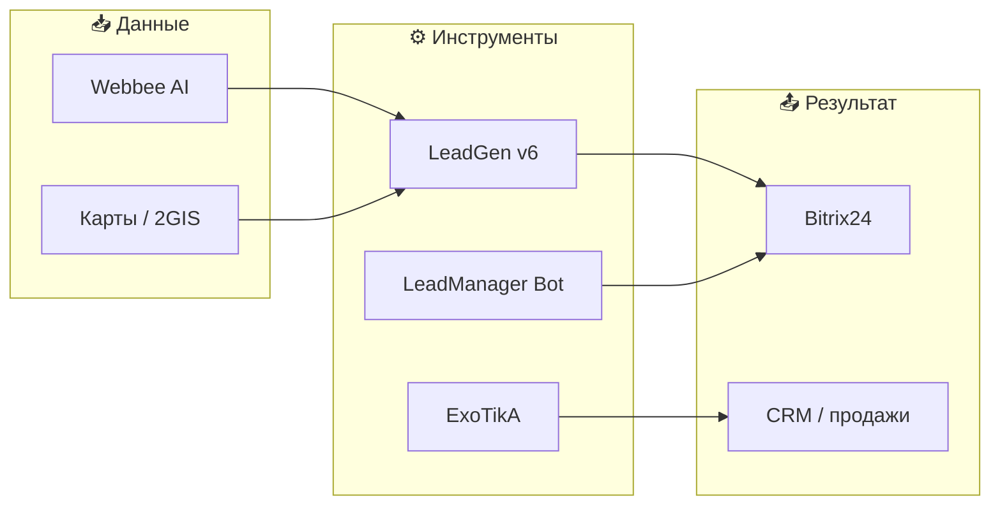

<!-- Hero -->

 

  

 

**Navigate:** [RU](#-ru--обо-мне) · [EN](#-en--about-me) · [Featured](#-featured--избранное) · [Stack](#-tech-stack) · [MITA](#-мита--marketing-it-agency) · [Activity](#-github-activity)

---

## ✦ Featured / Избранное

<table>
<tr>
<td width="50%" valign="top">

### 🤖 [ExoTikA](https://github.com/iac-iac-iac/ExoTikA)

Локальный **AI-компаньон** для Windows: **Tauri 2**, **React**, **SQLite**, **OpenRouter**, память, RU/EN.

[Releases](https://github.com/iac-iac-iac/ExoTikA/releases) · [README EN](https://github.com/iac-iac-iac/ExoTikA/blob/main/README.md) · [README RU](https://github.com/iac-iac-iac/ExoTikA/blob/main/README.ru.md)

</td>
<td width="50%" valign="top">

### 📊 [LeadGen v6](https://github.com/iac-iac-iac/LeadGen_v6)

**WPF** · Webbee AI · **Bitrix24 CSV** · ссылки **Яндекс.Карт**

[Скачать](https://github.com/iac-iac-iac/LeadGen_v6/releases/latest) · [Repo](https://github.com/iac-iac-iac/LeadGen_v6)

</td>
</tr>
<tr>
<td width="50%" valign="top">

### 💬 [LeadManager_TGBot](https://github.com/iac-iac-iac/LeadManager_TGBot)

Telegram-бот для **холодных лидов** + **Bitrix24**: статусы, воронка, быстрый handoff.

</td>
<td width="50%" valign="top">

### 🏢 [mita-marketing-agency](https://github.com/iac-iac-iac/mita-marketing-agency)

Сайт **М.И.Т.А.**: **Next.js 14**, **TypeScript**, **SQLite** CMS.

</td>
</tr>
</table>

---

## 🇷🇺 RU | Обо мне

Я разрабатываю **практичные цифровые системы** на стыке маркетинга, продаж и IT: Telegram-боты, CRM-интеграции, десктопные приложения и веб-платформы.

Фокус — инструменты, которые помогают **быстрее находить клиентов**, обрабатывать заявки, управлять лидами и убирать ручную рутину.

Работаю в рамках **[М.И.Т.А.](https://github.com/iac-iac-iac/mita-marketing-agency)** — маркетингового IT-агентства полного цикла.

### Что создаю

| Направление | Примеры |
|-------------|---------|
| **Лидогенерация** | [LeadGen v6](https://github.com/iac-iac-iac/LeadGen_v6) — обработка Webbee, экспорт Bitrix, Яндекс.Карты |
| **CRM & боты** | [LeadManager_TGBot](https://github.com/iac-iac-iac/LeadManager_TGBot) + Bitrix24 |
| **AI на десктопе** | [ExoTikA](https://github.com/iac-iac-iac/ExoTikA) — локальный чат, память, OpenRouter |
| **Веб** | Next.js, TypeScript, SQLite CMS |
| **Автоматизация** | Пайплайны холодных продаж, парсинг, отчёты |

### LeadGen v6 — флагман лидогенерации

> Десктоп на **.NET 10 / WPF**: дашборд, обработка JSON·TSV·CSV, дедупликация, менеджеры, экспорт в Bitrix24, генератор ссылок по 42+ городам.

---

## 🛠 Tech Stack

  

  
  
  
  
  

---

## 🏢 М.И.Т.А. | Marketing IT Agency

**Маркетинг через инженерное мышление** — стратегия, упаковка, автоматизация, CRM и инструменты под задачи бизнеса.

- Маркетинговые сайты и лендинги
- Telegram-боты и CRM-интеграции
- Автоматизация продаж и обработки лидов
- Системы холодных продаж и лидогенерации
- AI-инструменты для операций и маркетинга

---

## 📈 GitHub Activity

  
  

  

Cards: github-readme-stats · theme aligned with dark UI

---

## 🇬🇧 EN | About Me

I build **production-ready systems** where marketing meets engineering: Telegram bots, CRM integrations, desktop apps, and modern web products.

**Focus:** tools that help teams find clients faster, process leads, run sales workflows, and cut manual work.

Building under **[M.I.T.A.](https://github.com/iac-iac-iac/mita-marketing-agency)** — a full-cycle marketing IT agency.

### What I build

- **LeadGen v6** — Windows desktop (**WPF**, .NET 10): Webbee AI ingest, Bitrix24 CSV export, Yandex Maps link generator, SQLite dashboard
- **LeadManager_TGBot** — cold-lead Telegram bot + Bitrix24
- **ExoTikA** — local-first AI companion (Tauri, React, SQLite, OpenRouter)
- **mita-marketing-agency** — agency site (Next.js 14, TypeScript, SQLite CMS)
- Bitrix24 integrations, automation pipelines, AI-assisted ops

---

## 📬 Contact

  
  
  

---

**Building systems that turn marketing, sales, and operations into working software.**

Last profile refresh · LeadGen v6 · 2026

